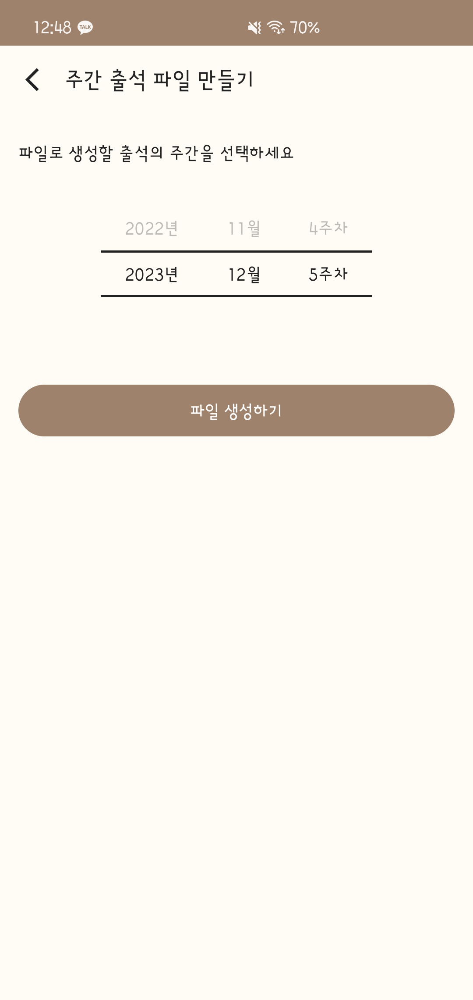

# AttendanceArchive
Antioch Attedance Archive

## Google Play
https://play.google.com/store/apps/details?id=com.jin.attendance_archive

## Screenshot
   

## Description
- apply MVSM(Model-View-StateModel) pattern
- use firebase realtime database REST API + SSE(server-sent-events)
- use POI library for creating excel files
- use [Coroutines](https://kotlinlang.org/docs/coroutines-overview.html) for Asynchronous programming
- use [Compose](https://developer.android.com/jetpack/compose) for UI
